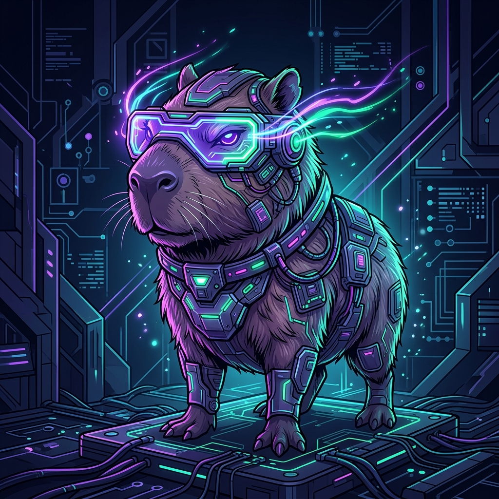

<p align="center">
  
</p>

<h1 align="center">Treinamento OIAA - Desafio de Inteligencia Artificial</h1>

<p align="center">
  
  
  
  
  
  
</p>

<p align="center">
  <strong>Plataforma oficial de gerenciamento e pontuacao para o Desafio Tecnico de Inteligencia Artificial (OIAA) do IF Goiano - Campus Hidrolandia.</strong>
</p>

<p align="center">
  <a href="#fases-do-projeto">Fases do Projeto</a> •
  <a href="#estrutura-dos-desafios-5-etapas">Estrutura dos Desafios</a> •
  <a href="#gerenciamento-de-equipes-e-notas">Gerenciamento de Equipes</a> •
  <a href="#tecnologias-e-arquitetura">Tecnologias</a> •
  <a href="#como-executar-localmente">Como Executar</a> •
  <a href="#endpoints-da-api">Endpoints da API</a> •
  <a href="#autor">Autor</a>
</p>

<hr />

<p align="center">
  A plataforma gerencia o progresso dos alunos nos tres pilares academicos fundamentais do desafio:
</p>

<table align="center">
  <tr>
    <td align="center"><b>Processamento de Linguagem Natural (NLP)</b></td>
    <td align="center"><b>Visao Computacional (VC)</b></td>
    <td align="center"><b>Aprendizado de Maquina (AM)</b></td>
  </tr>
  <tr>
    <td>Resgate de palavras perdidas em livros antigos corrompidos pelo tempo.</td>
    <td>Classificacao de placas de transito para carros autonomos (Pare vs. Velocidade Maxima).</td>
    <td>Sistema de recomendacao preditiva de filmes estilo Netflix, YouTube e TikTok.</td>
  </tr>
</table>

## Fases do Projeto

A jornada de aprendizado e competicao e organizada em 3 fases:

<ul>
  <li><b>Fase 1 (Concluida)</b>: Documentacao conceitual, regras e narrativa de cada desafio.</li>
  <li><b>Fase 2 (Em andamento)</b>: Estrutura de codigo-bruto. Fornecimento de esqueletos dos algoritmos com lacunas logicas.</li>
  <li><b>Fase 3 (Concluida)</b>: Sistema de avaliacao, classificacao e ranking dinamico em tempo real.</li>
</ul>

## Estrutura dos Desafios (5 Etapas)

Cada um dos tres pilares (NLP, VC, AM) e composto por 5 etapas de aprendizado/desafio, cada uma valendo uma pontuacao especifica por integrante:

<ol>
  <li><b>Teoria (10 pontos)</b>: Explicacoes, resumos, conceituacao dos dados, otimizadores e modelos.</li>
  <li><b>Treinamento Basico com Auxilio (15 pontos)</b>: Execucao de um pipeline guiado com dicas passo a passo e recomendacoes.</li>
  <li><b>Treinamento sem Auxilio (20 pontos)</b>: Reproducao do pipeline de maneira autonoma, justificando escolhas de hiperparametros e arquitetura.</li>
  <li><b>Preenchimento de Lacunas (25 pontos)</b>: Implementacao de codigo pratico preenchendo as lacunas logicas marcadas com <code># [PASSO EM BRANCO - IMPLEMENTE AQUI A LOGICA]</code> nos esqueletos fornecidos.</li>
  <li><b>IA do Zero (30 pontos)</b>: Construcao da solucao final dividida em dois modos:
    <ul>
      <li><i>Modo com Blocos</i>: Montagem visual ou modular usando componentes pre-definidos.</li>
      <li><i>Modo do Zero</i>: Codificacao integral do pipeline utilizando o conhecimento consolidado.</li>
    </ul>
  </li>
</ol>

## Gerenciamento de Equipes e Notas

* **Estrutura do Grupo**: Cada grupo e composto por 3 integrantes (alunos) e 1 tutor (professor).
* **Calculo da Nota Individual**: E a soma dos pontos obtidos pelo aluno em todas as etapas de todos os pilares (limite maximo de 300 pontos), normalizada em uma escala de 0 a 100.
* **Calculo da Nota do Grupo**: E a media aritmetica simples das notas individuais dos alunos do grupo.
* **Regra do Tutor**: O tutor e cadastrado junto ao time, mas nunca entra no calculo da media ou pontuacao do grupo.
* **Area do Tutor (Painel Administrativo)**: Uma secao dedicada (<code>/admin</code>) permite ao tutor lancar notas com validacao Zod automatica em relacao ao limite de pontos de cada etapa, alem de monitorar o rendimento geral e excluir equipes se necessario.

## Tecnologias e Arquitetura

* **Frontend & UI**: Next.js 14 (App Router) e TypeScript. Estilizacao em Tailwind CSS com tema Dark/Cyberpunk moderno, glows neon personalizados por pilar e componentes baseados em Shadcn/UI (Button, Table, Card, Input, Badge).
* **Backend & Persistencia**: API Routes protegidas por tokens, schemas robustos de validacao Zod, banco de dados Neon PostgreSQL em producao (Vercel) e fallback local automatico para arquivo JSON (<code>web/data/teams.json</code>) quando executado em modo offline.

<details>
<summary><b>Clique para ver a Estrutura de Diretorios</b></summary>

```text
TreinamentoOIAA/
├── .agents/                                             # Customizacoes e regras dos agentes
│   └── AGENTS.md                                        # Regras que os agentes devem seguir
├── aprendizado_de_máquina_(kaggle)_1°_fase (1).py       # Script original AM
├── visão_computacional_(kaggle)_1°_fase (1).py          # Script original VC
├── cópia_de_linguagem_natural_(kaggle)_1°_fase (1).py    # Script original NLP
├── .gitignore                                           # Arquivo de exclusao do Git
├── capivara-icon/                                       # Pasta do mascote da OIAA
│   └── capivara.png                                     # Imagem do mascote OIAA 2026
├── README.md                                            # Este arquivo descritivo
└── web/                                                 # Aplicacao Web (Next.js)
    ├── app/
    │   ├── admin/                                       # Painel do Tutor (Lancamento de notas)
    │   ├── api/                                         # API Routes (times, notas, desafios)
    │   ├── challenges/                                  # Narrativas dos pilares e 5 etapas
    │   ├── code/                                        # Visualizador dos esqueletos de codigo
    │   ├── leaderboard/                                 # Placar geral com filtros e busca
    │   └── teams/                                       # Cadastro e listagem de times
    ├── components/                                      # Componentes compartilhados e Shadcn/UI
    ├── data/                                            # Arquivos de dados locais (teams.json)
    ├── lib/                                             # Camada de logica, tipos e banco de dados
    ├── package.json                                     # Configuracao de pacotes
    └── tailwind.config.ts                               # Tokens de cores cyberpunk
```
</details>

<details>
<summary><b>Clique para ver as Instrucoes de Como Executar Localmente</b></summary>

### Pré-requisitos
* Node.js v18 ou superior.

### Instalacao e Execucao

1. Acesse o diretorio do frontend:
   ```bash
   cd web
   ```

2. Instale as dependencias do projeto:
   ```bash
   npm install
   ```

3. (Opcional) Crie o arquivo de variaveis de ambiente:
   ```bash
   cp .env.example .env.local
   ```
   * Configure `ADMIN_TOKEN` com uma senha de sua preferencia para conseguir lancar notas na Area do Tutor local.
   * Configure `DATABASE_URL` apenas se desejar testar a persistencia conectada ao Neon Postgres. Caso contrario, a gravacao sera feita diretamente no arquivo `data/teams.json`.

4. Inicie o servidor de desenvolvimento:
   ```bash
   npm run dev
   ```
   Acesse a plataforma em http://localhost:3000.

5. Para testar o build de producao:
   ```bash
   npm run build
   ```
</details>

<details>
<summary><b>Clique para ver os Endpoints da API</b></summary>

| Metodo | Endpoint | Descricao |
|:---|:---|:---|
| GET | /api/challenges | Retorna os metadados dos 3 desafios e suas 5 etapas correspondentes. |
| GET | /api/code/[pillar] | Retorna o bloco de imports e o esqueleto de codigo para o pilar (nlp, vc, am). |
| GET | /api/teams | Retorna o ranking de equipes ordenado por nota do grupo, suportando busca (?search=) e ordenacao (?sortBy=name). |
| POST | /api/teams | Cria uma nova equipe de estudantes (sem notas). Aberto aos alunos. |
| DELETE | /api/teams/[id] | Exclui um time permanentemente. Requer header x-admin-token. |
| POST | /api/teams/[id]/scores | Lanca ou atualiza a nota de um integrante. Requer header x-admin-token. |
</details>

---

<h2 align="center">Autor</h2>

<p align="center">
  <a href="https://github.com/ThyagoToledo">
    
    <br />
    <sub><b>ThyagoToledo</b></sub>
  </a>
</p>
